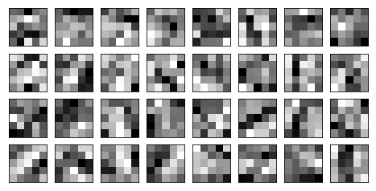

# **Traffic Sign Recognition**
&nbsp;
*Udacity Self-Driving Car Engineer Nanodegree Project 2*

 
 

_Predicting the class of a traffic sign_

### **Project Overview**

This project contains the results from completing Project 2 of the Udacity Self-Driving Car Engineer Nanodegree. The goal of this project is to create a convolutional neural network capable of classifying a set of traffic signs, originally taken from the [German Traffic Sign Dataset](http://benchmark.ini.rub.de/?section=gtsrb&subsection=dataset) with an accuracy of at least 93%.

_5x5 Patches from the weights applied to the first convolutional layer_

#### Files in the repository
* Code for the pipeline is contained in the [Traffic Sign Classifier Notebook](./Traffic_Sign_Classifier.ipynb)
* A [writeup](./WRITEUP.md) detailing the results of the project and describing the procedure for creating a model capable of achieving those results

#### Running the code
This project was developed using Python 3.5. The IPython notebook can be run using [Jupyter Notebooks](http://jupyter.org/). The project depends on the [NumPY](http://www.numpy.org/), [OpenCV](http://opencv.org/), [Matplotlib](http://matplotlib.org/) & [TensorFlow](https://www.tensorflow.org/) libraries.
