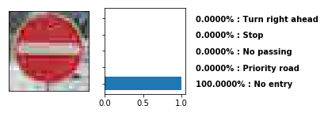
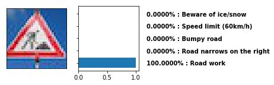

# **Traffic Sign Recognition**

**Building a Convolutional Neural Net to Correctly Classify Traffic Signs**

The goal of this project is to create a convolutional neural network capable of classifying a set of traffic signs, originally taken from the [German Traffic Sign Dataset](http://benchmark.ini.rub.de/?section=gtsrb&subsection=dataset). From the website, this set is characterized as a single-image, multi-class classification problem, composed of more than 50,000 unique images of traffic signs commonly found in Germany. Before attempting to design the solution, however, I am going to spend some time getting to know the data I'm working with.

## Dataset Exploration

The dataset I'll be using is broken into the following groups:
* 34,799 Training examples
* 4,410 Validation examples
* 12,630 Testing examples

The images are RGB, 32x32 pixels in dimension. There are a total of 43 separate classes represented. Using Matplotlib's `hist` method, we can visualize how evenly the various classes are distributed.

Here we see that some images are represented far more frequently than others. The class labeled 0 ("Speed limit (20km/h)") in the dataset is the least represented, with only 210 examples.

On the other hand, the class labeled 2 ("Speed limit (50km/h)") has 2010 examples, which is over an order of magnitude difference!

This begs the question, why the huge inequality? Is a driver in Germany really 10 times as likely to encounter a 50 km/h sign vs. a 20 km/h sign? However, I ultimately chose to keep leave that distribution unchanged, as it closely matches the dataset as a whole.

---
## Designing and Testing a Convolutional Neural Net Model

Prior to this project, I built a [Lenet-5](http://yann.lecun.com/exdb/lenet/) implementation. This used the following model architecture.

| Layer                   |     Description                               |
|:-----------------------:|:---------------------------------------------:|
| Input                   | 32x32x3 RGB image                             |
| Convolution 1 5x5       | 1x1 stride, valid padding, outputs 28x28x6    |
| Max pooling             | 2x2 stride, valid padding, outputs 14x14x6    |
| Convolution 2 5x5       | 1x1 stride, valid padding, outputs 10x10x16   |
| Max pooling             | 2x2 stride, valid padding, outputs 5x5x16     |
| Flatten                 | outputs 400                                   |
| Fully connected 1       | outputs 120                                   |
| Fully connected 2       | outputs 84                                    |
| Fully connected 3 (out) | outputs 43 (matching the number of classes)   |

Training the data on this model yielded ~89% accuracy on the validation set and a little over 90% on the test set. Not terrible result for a first pass, but could definitely be improved upon.

### Preprocessing

Above is a random sampling of images before preprocessing. It's easy to see that some of these images are very dark and would be challenging for even a human to classify. So, the first step I took to improve this result was to preprocess the data in an attempt to better amplify the important features in the image.

I experimented with a number of ways to process and normalize the data, such as running the images through a Laplacian filter to enhance the edges in the images and normalize the values. However, the model performed best with histogram equalization and normalizing the image values from -0.5 to 0.5. It is also worth noting that there was no apparent degradation in performance when converting the input images to a single grayscale channel from RGB.

By applying histogram equalization to the images, which is conveniently handled by OpenCV's `equalizeHist` method, it is possible to correct for very dark and very bright lighting conditions. With just the preprocessing step, the model was able to achieve ~92% accuracy on the validation set.

### Improved Model Architecture

In order to achieve better performance, I needed to build a better CNN model. I decided to build the model described by [Alex Staravoitau](http://navoshta.com/traffic-signs-classification/#model). This differs from a simple, strictly feed-forward model like LeNet-5 in that the convolved, pooled layers are branched off and fed into a flattened, fully connected layer, noting that each of these convolutions is first passed through an additional max-pooling proportional to their layer size. In order to prevent overfitting to the training data, I also applied a 50% dropout to the fully connected layers.

| Layer                   |     Description                               |
|:-----------------------:|:---------------------------------------------:|
| Input                   | 32x32x1 Grayscale image                       |
| Convolution 1 5x5       | 1x1 stride, same padding, outputs 32x32x32    |
| Max pooling             | 2x2 stride, same padding, outputs 16x16x32    |
| Convolution 2 5x5       | 1x1 stride, same padding, outputs 16x16x64    |
| Max pooling             | 2x2 stride, same padding, outputs 8x8x64      |
| Convolution 3 5x5       | 1x1 stride, same padding, outputs 8x8x128     |
| Max pooling             | 2x2 stride, same padding, outputs 4x4x128     |
| Flatten                 | flatten each of the 3 pooled layers.          |
| Max pooling - layer 1   | 4x4 stride, same padding, outputs 1x2048      |
| Max pooling - layer 2   | 2x2 stride, same padding, outputs 1x1024      |
| Max pooling - layer 3   | 2x2 stride, same padding, outputs 1x512       |
|                         | Concatenate the 3 flattened, pooled layers, outputs 1x3584, 50% dropout
| Fully connected 1       | outputs 1x1024, 50% dropout                   |
| Fully connected 2 (out) | outputs 1x43                                  |

### Model Training

I decided on a simple learning rate of 0.001 over 100 epochs, using a batch size of 256. The weights were initialized with TensorFlow's `truncated_normal` method, with a mean of 0 and a standard deviation of 0.1. The loss was calculated by applying a softmax cross entropy function, comparing the predicted classes with the validation set. This is then optimized with the `tf.train.AdamOptimizer`, which uses Kingma and Ba's [Adam algorithm](https://arxiv.org/pdf/1412.6980v8.pdf) for first-order gradient-based optimization of randomized objective functions. Adam enables the model to use a large step size and move quickly to convergence without a lot of fine tuning.

And indeed, the accuracy of this model converges very quickly, with very little improvement seen beyond ~20 epochs.

My final model results were:
* validation set accuracy of 97.0%
* test set accuracy of 95.5%

### Testing the Model on New Images

Using Google image search, I tried to select a few good representations of traffic signs to run through my model. It was more challenging than I would have thought to find interesting test cases. Nearly every image I found was shot with good lighting conditions and nearly always perfectly head on. Here are the best candidates I could come up with in my search (cropped and resized to 32x32 px), along with the preprocessed versions I actually ran through the model.

The model correctly classified 6 out of the 7 images (87.5%). Of course, this is a very small sample, so the accuracy varies from the test set.

### Model Certainty - Softmax Probabilities

In order to better understand what the model is predicting and where it went wrong, let's output the top 5 predictions for each sign.

 
 
 
 
 

The model predicted with very near 100% certainty (to at least 4 decimal places!) every single sign, which isn't terribly surprising, given how clear the images are. However, the 1 incorrect prediction is a bit of a suprise.

At first glance, the 100 km/h Speed Limit sign seems to the human eye like a no brainer. The image has sharp contrast and very simple shapes without almost no noise, and the number 100 couldn't be clearer. And yet, the model guesses it is a 50 km/h Speed Limit sigh. At least it guessed the correct family of signs (speed limit)!

It's interesting to note that while the model was still 99.97% certain of its guess, this was the least confident of any of the guesses. The next most likely guess at 0.029% likelihood is a Stop sign, and behind that, at only 0.0001% likelihood is the correct prediction.

When looking back at the data, I notice that the 50 km/h Speed Limit sign has 2,010 examples in the training set, which incidentally is the most represented class in the entire dataset. The 100 km/h Speed Limit sign only has 1,260 examples. So, a possible improvement to prediction accuracy could be made by ensuring each class is equally represented. This would, of course, greatly decrease the size of the dataset.

In conclusion, I believe the model itself to be pretty robust. To get the accuracy above 99%, I think it necessary to augment the dataset, by ensuring all the classes are represented equally and by generating more skewed/partially cropped images.
